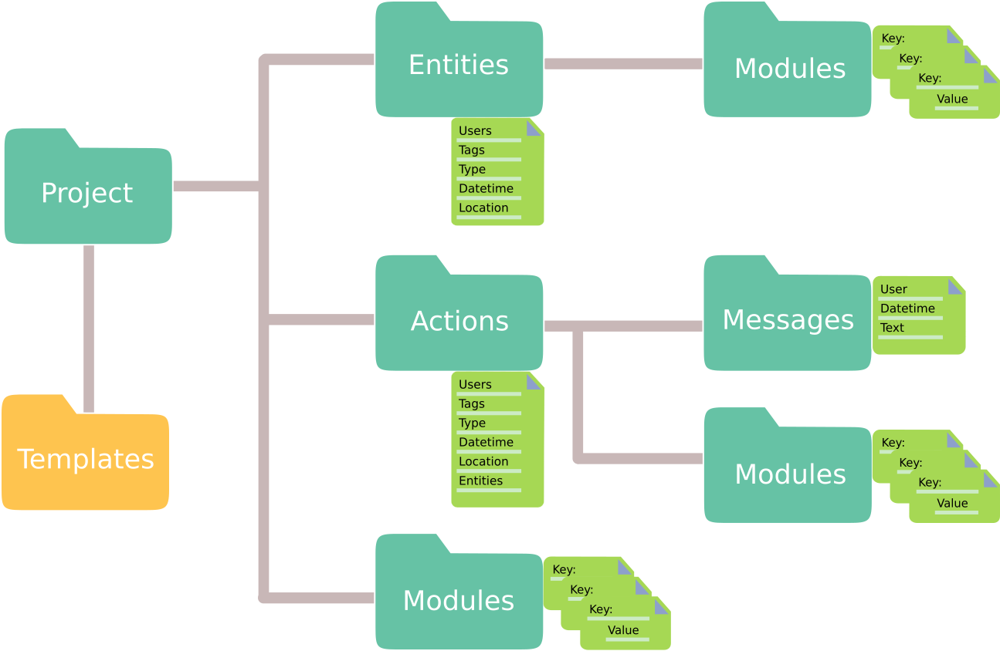

Introduction
------------

Technological advances are revolutionizing methods in neuroscience.
The vast collection of recording setups used, and the large
variety of experimental subjects puts high demands on flexible data organization.

Often in neuroscience, the experimental setup is not finalized or rigidly predefined
before data acquisition begins.
Results may require additional branches of experimentation or reevaluation of
the setup.
Put simply, experiments have a tendency to organically grow along the experimental
time line.

Expipe is thus introduced as an organizational tool that grow
organically together with the experimentation - to ease data management in such
experimental paradigms.

The aims of Expipe is to organize data and metadata in a way such that they:

* are flexible towards a multitude of user aspects.
* are readable for humans and machines for many years to come.
* are sharable.
* support high throughput data analysis.
* support multiple types of large-scale data sets.

To this end we use the flexible filesystem as a non structured (NoSQL)
type database to store data and metadata.
This way of storing metadata consist of assigning key-value pairs as Python
dictionaries.

An Expipe :code:`project` contains the object types :code:`actions`, :code:`entities`, :code:`modules`
and :code:`templates`.

Together, these objects represent an experimental project at large.
:code:`modules` sit at the core of the system and are used to describe :code:`projects`, :code:`actions`
and :code:`entities` in detail.
The :code:`modules` typically contain metadata about the equipment, environment, or subjects,
such as the numerical aperture of a microscope lens,
the serial number of an acquisition system,
or the temperature of a room.
:code:`actions` define events that occurred at a specific time,
such as an experiment, an analysis, or a simulation.
:code:`actions` have a few specific attributes, such as a timestamp, and store detailed metadata in :code:`modules`.
Entities are long-lived things that are used in an :code:`action`,
typically an experimental subject such as a rat or mouse.
:code:`actions` refer to Entities, but but they do not link directly to them.
:code:`messages` are user specific lines of text added to :code:`actions`, such as notes.

During an experiment metadata can be automatically added by user specific
:code:`templates`.
Templates are prefilled key-value pairs describing all aspects
of your experiments e.g. recording environment, acquisition system etc.
When added, :code:`templates` are introduced as `modules` which are descriptors of
:code:`project` and/or :code:`action` entities. A :code:`project` is the
root object during communication with :code:`expipe` and contain :code:`modules` and :code:`actions`.
:code:`actions` are individual, well actions, of interaction with experimental assets
or :code:`expipe` itself such as recordings or analysis respectively.
:code:`actions` also contain :code:`modules` which are specific to a particular :code:`action` in
contrast to :code:`project modules` which are more general.

We encourage users from neuroscience to base templates on the
`odML terminologies <http://www.g-node.org/projects/odml/terminologies>`_ which
can be `a priori` filled out by a user or added in an empty state for
`a posteriori` documentation.

